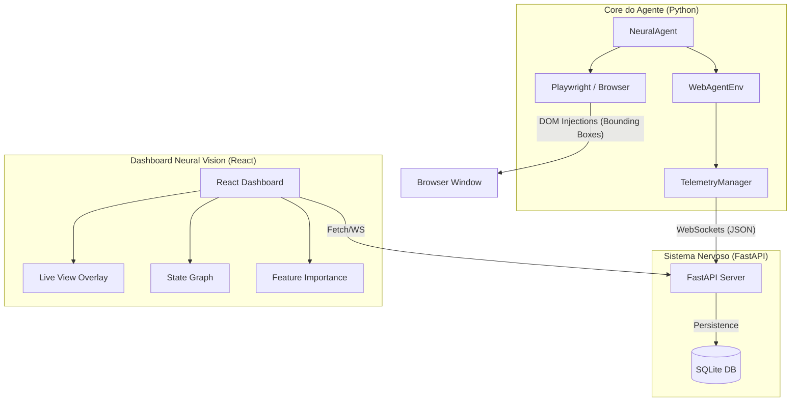
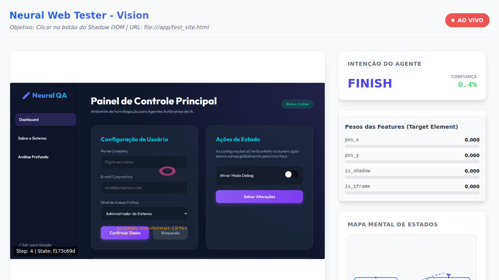

# Camada de Observabilidade Espacial: Neural Vision 👁️

Este documento detalha o funcionamento, a arquitetura e os componentes da nova camada de observabilidade do **neural_web_tester**. O objetivo é transformar ações abstratas em um "feedback de intenção" visual em tempo real.

---

## 🏗️ Arquitetura do Sistema

A arquitetura utiliza um modelo **Sidecar**, onde o core do agente (Python) transmite telemetria para um servidor independente que alimenta o dashboard.



---

## 🚀 Componentes Principais

### 1. Servidor de Telemetria (`observability/server.py`)
Um servidor assíncrono em FastAPI que:
- Gerencia WebSockets para broadcasting em tempo real.
- Persiste cada `step` (ação, confiança, screenshot, features) no banco `telemetry.db`.
- Oferece APIs REST para o modo "Time-travel" (histórico de sessões).

### 2. Dashboard Neural Vision (`observability/frontend/`)
Construído com **React**, **Vite**, **Tailwind CSS** e **React Flow**:
- **Live Preview:** Exibe o "olhar" do agente com bounding boxes de probabilidade (Verde: Top 1, Amarelo: Candidatos).
- **Mapa Mental (Grafo de Estados):** Visualiza as transições de estado do DOM baseadas em hash SHA-256. Ajuda a detectar loops infinitos.
- **Monitor de Features:** Gráfico de barras mostrando quais atributos (posição, shadow DOM, etc.) estão influenciando a decisão atual.
- **Controle de Timeline (Time-travel):** Permite navegar entre passos passados para depurar falhas.

### 3. Injeção de UI (`navigation.py`)
O agente injeta scripts diretamente no navegador controlado para prover feedback visual imediato (flashes e bordas nos elementos focados).

---

## 📡 Protocolo de Telemetria (WebSocket JSON)

As mensagens enviadas pelo agente seguem este esquema:

```json
{
  "type": "step_update",
  "data": {
    "session_id": "string",
    "step_number": 42,
    "state_hash": "sha256_hash",
    "screenshot_base64": "base64_string",
    "action": {
      "type": "CLICK",
      "element_id": 5,
      "confidence": 0.89
    },
    "observation": {
      "top_candidates": [
        {"id": 5, "prob": 0.89, "coords": [x, y, w, h], "label": "Tag Text"}
      ],
      "features_weights": {
        "pos_x": 0.7,
        "is_shadow": 0.1
      }
    }
  }
}
```

---

## 🛠️ Como Executar

### 1. Iniciar o Servidor de Telemetria
```bash
python3 observability/server.py
```

### 2. Iniciar o Frontend do Dashboard
```bash
cd observability/frontend
npm install
npm run dev
```

### 3. Rodar o Agente com Telemetria Ativa
Certifique-se de que o servidor FastAPI está rodando na porta 8000.
```bash
python3 agent.py --url https://meusite.com --bdd "Ao clicar em Login"
```

---

## 📸 Demonstração da Interface



A imagem acima demonstra o Dashboard em pleno funcionamento:
- **Painel Central:** O screenshot real do `test_site.html` com um overlay SVG destacando o elemento alvo em rosa (ID do botão Confirmar).
- **Intenção do Agente:** Mostra que o agente escolheu a ação `FINISH` com seus metadados.
- **Pesos das Features:** Lista as propriedades do elemento que influenciaram o modelo.
- **Mapa Mental:** (Abaixo) Mostra os nós de estado percorridos.

## 🧪 Suíte de Testes (BDD e Unitários)

Para garantir a confiabilidade da telemetria, implementamos testes rigorosos:

### 1. Testes de Unidade (FastAPI & SQLite)
```bash
PYTHONPATH=. pytest tests/test_observability_unit.py
```

### 2. Testes BDD (Integração de Fluxo)
Verifica se o agente comunica corretamente com o backend usando cenários Gherkin.
```bash
PYTHONPATH=. pytest tests/step_defs/test_observability.py
```

> **Nota:** Esta camada foi projetada para ser leve e não interferir no treinamento do modelo RL, operando de forma assíncrona.
