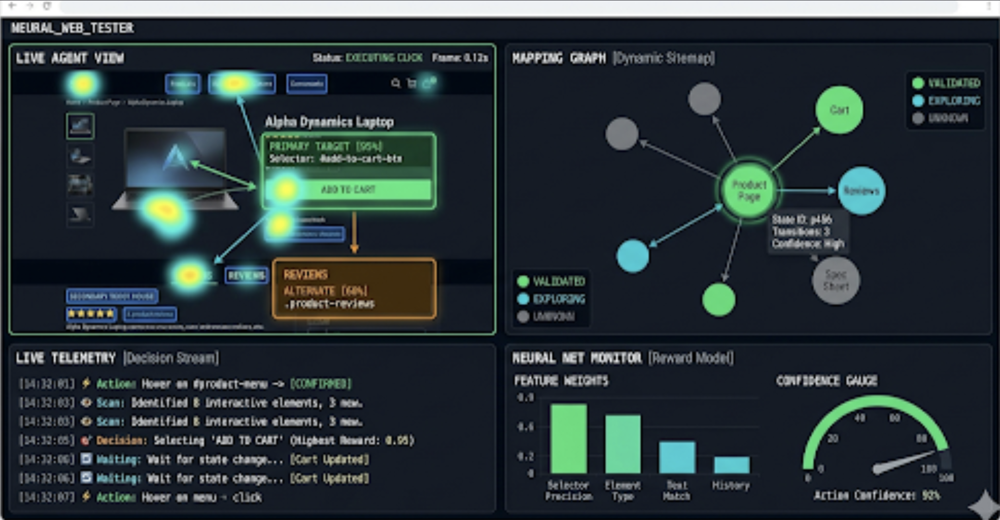

# Neural Web Tester 🤖🌐



O **Neural Web Tester** é um projeto educacional focado em ensinar desenvolvedores a implementarem redes neurais simples na prática. Ele utiliza o pretexto de uma ferramenta CLI de exploração autônoma de aplicações web para demonstrar conceitos de Visão Computacional e Memória Semântica.

> **Objetivo:** Desmistificar o uso de IA (MobileNetV2) e Geometria Vetorial em aplicações reais de engenharia de software.

---

## 🎓 Aprenda com este projeto

Este repositório foi desenhado para ser um guia de estudo. Comece por aqui:

- [🧠 **Introdução à IA Prática:** Como o Agente "Pensa"?](docs/education/introducao_ia_pratica.md)
- [🏗️ **Arquitetura do Código:** Da Teoria à Prática](docs/technical/arquitetura_do_codigo.md)
- [🚀 **Tutorial:** Seu Primeiro Teste com IA](docs/tutorial_seu_primeiro_teste_ia.md)

---

## 🚀 Guia de Início Rápido (Hands-on)

### Requisitos
- **Python:** 3.8 ou superior
- **Node.js:** Necessário para o Playwright gerenciar os navegadores.

### Setup Rápido

1. Clone o repositório:
   ```bash
   git clone <repo-url>
   cd neural-web-tester
   ```

2. Instale as dependências:
   ```bash
   task install
   ```

3. Configure o ambiente:
   ```bash
   cp .env.example .env
   # Edite o arquivo .env com suas chaves e tokens
   ```

## 🛠️ Guia de Uso (Dashboard Web)

Agora você pode controlar o agente através de uma interface web intuitiva:

1. Inicie a Bridge API:
   ```bash
   task api:dev
   ```

2. Inicie o Frontend:
   ```bash
   task web:dev
   ```

3. Acesse `http://localhost:3000` no seu navegador. Insira a URL de destino e o objetivo Gherkin para começar.

### Uso via CLI

Se preferir, você ainda pode rodar o agente diretamente:

```bash
task agent:run URL=https://exemplo.com BDD="Explorar site" STEPS=10
```

## 🏗️ Estrutura do Projeto

- `src/`: Core do projeto em Python.
  - `agent.py`: Orquestrador do loop de exploração do agente.
  - `api.py`: Ponte FastAPI para controle via web.
  - `navigation.py`: Gerenciamento do navegador via Playwright.
  - `perception.py`: Camada de visão computacional (MobileNetV2).
  - `model.py`: Redes neurais de raciocínio.
- `web/`: Dashboard Next.js / Tailwind para controle do agente.
- `templates/`: Templates Jinja2 para relatórios offline.
- `tests/`: Suíte de testes automatizados (BDD e Unitários).

## 🧪 Desenvolvimento e Automação

O projeto utiliza o **Task** (`Taskfile.yml`) para padronizar comandos comuns:

- `task install`: Instala dependências Python e Node.js.
- `task web:dev`: Roda o frontend Next.js.
- `task api:dev`: Roda a API de ponte.
- `task dev`: Sobe ambos (Frontend e API) simultaneamente.
- `task test`: Executa os testes automatizados.
- `task lint`: Verifica o estilo do código.
- `task clean`: Limpa arquivos temporários e logs.

## ⚠️ Troubleshooting (Resolução de Problemas)

### Timeout do Playwright
Se o site alvo for muito pesado, o agente pode sofrer timeout.
- **Dica:** Tente rodar com `HEADLESS=false` no `.env` para observar o comportamento do navegador ou aumente o tempo de espera no `navigation.py`.

### Autenticação e Sessão
- Monitore se o `AGENT_TOKEN` no `.env` não expirou, impedindo o acesso a áreas autenticadas do site.

### Erros de TensorFlow/Modelos
O carregamento inicial do modelo MobileNetV2 pode demorar alguns segundos na primeira execução pois ele baixa os pesos pré-treinados da ImageNet.
- Certifique-se de ter conexão com a internet no primeiro uso.
