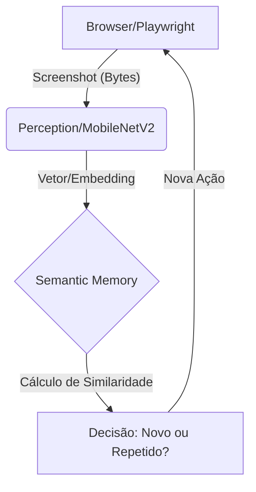

# 🏗️ Arquitetura do Código: Da Teoria à Prática

Agora que você já entende os conceitos por trás do nosso agente neural, vamos abrir o capô e ver como as linhas de código Python transformam esses conceitos em realidade.

O projeto é dividido em módulos pequenos onde cada um tem uma responsabilidade clara no "sistema nervoso" do agente.

---

## 1. Percepção: Transformando Pixels em Vetores (`perception.py`)

É aqui que a "mágica" da Visão Computacional acontece. Usamos a biblioteca **TensorFlow** para carregar o cérebro pré-treinado.

```python
# Trecho simplificado do perception.py
def load_mobilenet_extractor():
    # Carregamos a MobileNetV2 sem a camada de classificação final (include_top=False)
    # Queremos os "conceitos" da imagem, não que ela nos diga se é um "gato" ou "cachorro".
    model = tf.keras.applications.MobileNetV2(
        input_shape=(224, 224, 3), include_top=False, weights="imagenet", pooling="avg"
    )
    return model
```

**O que acontece aqui?**
- `input_shape=(224, 224, 3)`: Redimensionamos qualquer print do site para esse tamanho minúsculo. A rede neural não precisa de 4K de resolução para entender o layout.
- `pooling="avg"`: Isso transforma as camadas internas complexas em um único vetor simples de números (**Embedding**).

---

## 2. Memória: A Matemática da Comparação (`memory.py`)

A classe `SemanticMemory` guarda uma lista de todos os "DNAs" (embeddings) das páginas já visitadas. A função crucial aqui é a `cosine_similarity`.

```python
def cosine_similarity(v1, v2):
    # O "Produto Escalar" nos diz o quanto os vetores apontam para a mesma direção
    dot_product = np.dot(v1, v2)
    norm_v1 = np.linalg.norm(v1)
    norm_v2 = np.linalg.norm(v2)
    
    return dot_product / (norm_v1 * norm_v2)
```

**Por que Python e NumPy?**
Usamos o `numpy` porque ele faz esses cálculos matemáticos de vetores de forma extremamente rápida, o que é essencial para que o agente não "trave" enquanto pensa.

---

## 3. O Orquestrador: O Ciclo de Vida do Agente (`agent.py`)

O arquivo `agent.py` é o coração que bate. Ele conecta a mão (navegador) ao cérebro (modelo).

Observe como o loop principal (`explore`) é simples:

```python
# Passos simplificados no agent.py
screenshot = await self.browser.capture_state()         # O agente "abre o olho"
embedding = get_embedding(self.model, screenshot)         # O agente "processa a visão"
is_new = self.memory.is_new_state(embedding)             # O agente "tenta lembrar"

if not is_new:
    print("Já estive aqui, vou tentar outro caminho!")
```

---

## 🔄 Fluxo de Dados (Mermaid)

Aqui está como a informação flui pelo sistema:



---

## 💡 Lição para o Desenvolvedor
Note que você não precisou criar uma rede neural do zero. Você usou uma **Rede Pré-treinada** (Transfer Learning) e aplicou matemática vetorial básica para resolver um problema complexo de navegação. Esse é o segredo para usar IA em projetos reais: **composição de ferramentas.**

---
**Próximo Passo:** [Seu Primeiro Teste com IA](../tutorial_seu_primeiro_teste_ia.md)
